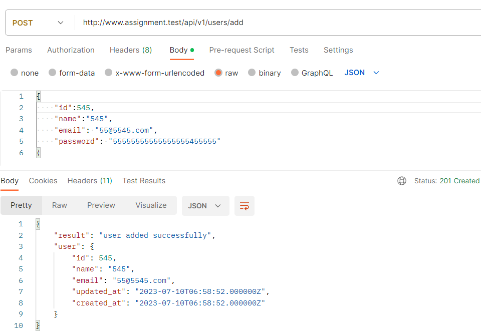
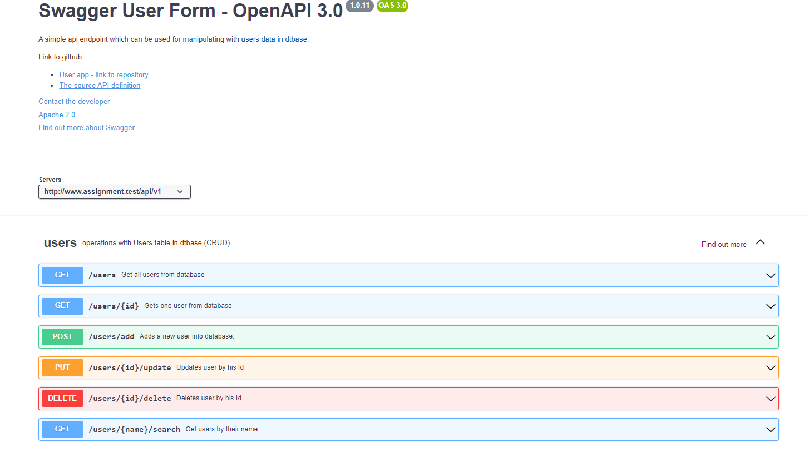

# Assignment

K PHP jsem se vrátil v tomtu úkolu po delší době, musím přiznat, že jsem musel strávit nějakou chvíli, abych si oživil syntax a principy. Úplně nejsem s výsledkem spokojen, nicméně nelze to dělat měsíc :smile: , tudíž doufám, že to splňuje požadavky na MVP.

## PHP framework - Laravel

App jsem si nastavil na virtuální adrese: assigment.test a připojil dostupnou databázi phpMyAdmin (lokální Apache server přes XAMPP)

App obsahuje základní features: registraci uživatele, také následný login, čtení z dat, mazání úživatelů

Prvně jsem plánoval pro front-end použít také React s nějakým hezčím stylingem, nicméně kvůli času jsem od toho záměru opustil, a tak řešení je pouze php + html a pár řádků css.

Rozhodl jsem se také udělat dvě ukázky, kdy práce s daty v rámci appky z pohledu uživatele je řešena v jednom controlleru.\
Oddělené API v jiném controlleru, které jsou otevřené a lze se na ně napojit. CRUD operace testovány v POSTMANOVy.

## DTB

pro rychlou přípravu DTB použity ,,helpers,, v rámci Laravelu (php artisan)\
Migrations\
Seeders\
[dump file zde](assignment.sql)

## Packages

Laravel už sam o sobě obsahuje množství balíčků, které usnaďnují standartní oparace a funkce, ale ne se všemi mám praktickou zkušenost

### Fortify

pro snadné založení/registraci nového uživatele\
obsahuje základní validační metody pro každý input a hash passwordu\

Sanctum pro authentifikaci, ale prakticky jsem ho ani nepoužil\
Pro API jsem si vystačil bez použití nějakého balíčku, i když jsem uvažoval např. o Restify, ale to bych musel vzít více času nastudovat dokumentaci

## Docker

S Dockerem bohužel praktické zkušenosti nemám, doposud jsem s ním v práci nepřišel do kontaktu.\
Nicméně vím, že je to důležitý skill a mám ho zařazen v mém backlogu na learning :smile:
Již jsem zkoušel containerizaci na malé javascriptí appce , např [zde](https://github.com/Lenny606/dockerlesson), ale doposud nic většího, tudíž sem se do tohoto tasku nepouštěl.

## App

Základní funkcionality, aby bylo možné vytvořit, upravit, načíst a smazat uživatele.

Domovská stránka s navbarem, kde je možné se registrovat či přihlásit.\

Registrace má základní validaci pro požadované hodnoty\

Po registraci přesměrováno zpět na homepage a uživatel je přihlášen.\
Možnost logout v navbaru, zobrazí se také btn pro zobrazení seznamu uživatelů.\

Na stránce uživatelů je z databáze načten seznam s pár informacemi.\

Každý záznam je možné dále upravit, což přesměruje na detail uživatele...\

...nebo smazat.\

Nepřihlášený uživatel k informacím nemá přístup.\

## API

[Controller](app/Http/Controllers/Api/UsersController.php) obsahuje endpointy, které vrací či edituje požadované data z databáze\

Např. POST request\

Ne všechny statusy jsou ošetřeny

dokumentaci jsem se tvořil na základě Swagger vzoru v yaml formátu ve swagger editoru, poté převedeno do json\
[Open API Documentation](openapi.json)

